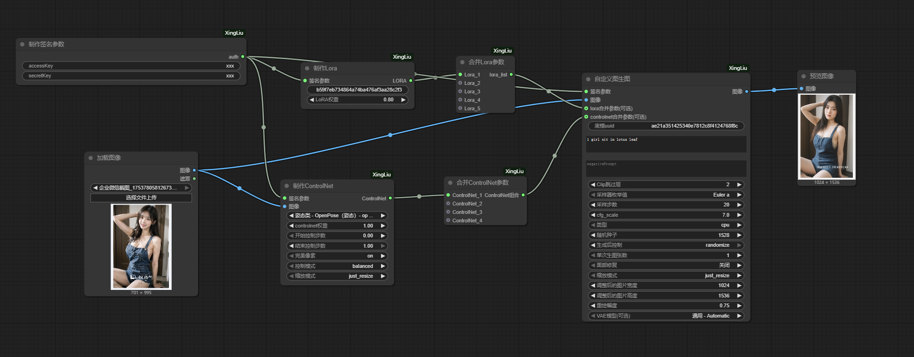

# ComfyUI-XingLiu
集成了 LibLibAI 的 Xingliu 文字转图像和图像转图像生成功能，并支持可自定义的 ControlNet 和 Lora 功能。

目前只使用F.1进行生成

可灵图生视频目前无法使用。

uuid获取参考[LiblibAI x 星流 图像大模型API 使用说明](https://liblibai.feishu.cn/wiki/UAMVw67NcifQHukf8fpccgS5n6d)

## 文生图 

### 星流Start-3 Alpha

### 自定义模型

## 图生图

### 星流Start-3 Alpha

### 自定义模型

## F.1 Kontext

### 文生图

### 图生图

## 可灵

### 文生视频

### 图生视频
可灵图生视频目前无法使用。
官方上传到oss获取到的url会报格式错误，只能上传到自有oss进行使用，本项目暂时还是以官方oss为基础